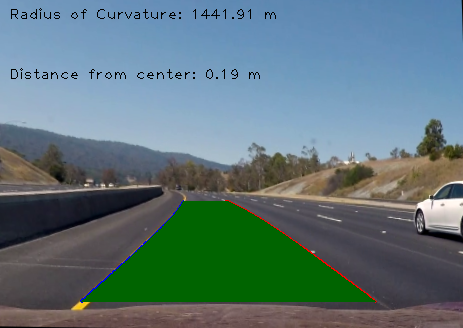

## Advanced Lane Finding

PROJECT DESCRIPTION: In this project, the goal is to write a software pipeline to identify the lane boundaries in a video, but the main output or product is a detailed writeup of the project (this README.md). The main code for lane detection is in the `frame_processing.py` file. Within the file the core function controlling the flow of lane detection is `detect_lanesV2()` within the `processFrame` class.

Step 1, Camera Calibration:
---
Camera calibration is necessary to ensure the frames you are recieving from the camera are undistored images. Distortion can cause incorrect calculations of 3D space from a 2D image. To minimize error in these calculations, the camera must be calibrated. This is done by taking at least 20 pictures of a checkerboard and calculating object/image points from these images using the `cv2.findChessboardCorners()` function in opencv. These points are used to calculate the mtx and dist transformation matrices that transform our distorted image to an undistorted image. An axample of a correct calibration of the checkerboard is shown below.

To see how this appears once we are driving on the road, another example of a correct undistortion is shown below.

The python code that was used to do the calibration is `camera_cal.py`. This code does the proper calibration and exports the mtx and dist matrices to a pickle file called `cal_pts.p` to use in the core lane detection code.

Step 2, Colorspace Threshing
---
A gui was developed for easier implementation of finding the proper thresholding values for solid lane detection. The gui can be seen if you run `python3 threshing_gui.py project_video.mp4`. The project_video.mp4 argument can be changes to whatever video/image you want to analyze. 

The 3 different colorspaces I utilized in the threshing values were the regular RGB space, HSV space, and HLS space. The combination of threshing these three spaces allow a robust lane detection. A snippet of the code is shown below.

This snippet is from the core function I used for lane detection. It is in the frame_processing.py file within the processFrame class and is called `detect_lanesV2`.

The binary images were computed using the `colorspace_thresh()` function in my frame_processing.py code within my class called processFrame. The variable combo_canny was the binary image used for perspective transformation (birds-eye view)

Additional to the colorspace threshing, I also used common values for the canny low/high thresholds as well as the apertureSize threshold. All of the parameters used for lane detection can be seen in the `parameters.json` file.

Step 3, Birds-eye view perspective
---
Once a solid binary lane image was computed, I then had to get the birds-eye perspective of the image. This was done using opencv's `cv2.warpPerspective()` function. The function I made for use in my `detect_lanesV2` function is called `perspective_transform()` and can be seen in the `processFrame` class. A successful image of the perspective transformation is shown below.

The four corners of the input array were chosen to enusre the straightest lines possibe.

Step 4, Lane Pixel Detection
---
The perspective transform allows us to see the road in a top down view. Now we need to deteremine which pixels we see from the top are apart of the lanes. This was done using the `find_lane_pixels()` developed during the course lecture. The methods uses a number of sliding windows that center upon the detected points in the warped image. Then another layer of sliding windows is higher in the y direction to search the next set of pixels and this conitunes for the height of the frame. This process is costly as we are searching each window for lane pixels. An image showing this process is below.

The red and blue pixels show the detection of the lane pixels within the green boxes (sliding windows). 

To reduce computation time, after the initial frame finds the lane pixels and fits a polynomial using the previous sliding window method, we then just search around the previously detection polynomial for the next frame of lane pixels. This is shown below.

As you can see, there are additional pixels in the center of the image that are not detected since they are not within the region to detect lane lines.

Step 5, Lane polynomial
---
the lane polynomials are calculated using numpy's `np.polyfit()` function. We provide the x and y pixel values for the detected pixels from the pixel detection method and use those to fit a polynomial to the pixel points. See image below for polynomial fititng.

Step 6, Real-world transform
---
Transforming the pixel values to the real world was desired so we could calculate the radius of curvature and the distance between the center of the camera and the center of the lane. An image of the two functions to make these calculations is shown below.

Step 7, Final Output
---
You could either download the code and view the output from the gui that was created by running `python3 lane_detect_gui.py project_video.mp4'. Or you can [click here](https://github.com/nickgoberville/Udacity-selfdriving-nanodegree/blob/master/CarND-LaneLines-P2/output_files/Final_video.mp4) to download and view the video that was prerecorded.

Step 8, Future improvements
---
Multiple improvements are in mind in which could be applied to accomplish more robust lane detection. My code was not able to perform well with the challenge videos, so there is definately much that needs to be improved. Some ideas are...
* Apply machine learning methods for fitting a polynomial to the detected lane pixels.
* Apply some smoothing by storing previous lane data.
* Calculate a confidence value for each lane detection.
* Use Kalman filters to reduce fluctuations in detections.
* Implement a vanishing point calculation. All lane lines should connect at this point, reducing the very high fluctuations seen in the challenge videos.

